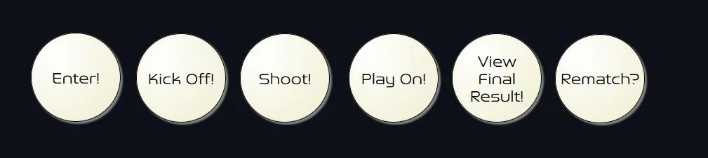
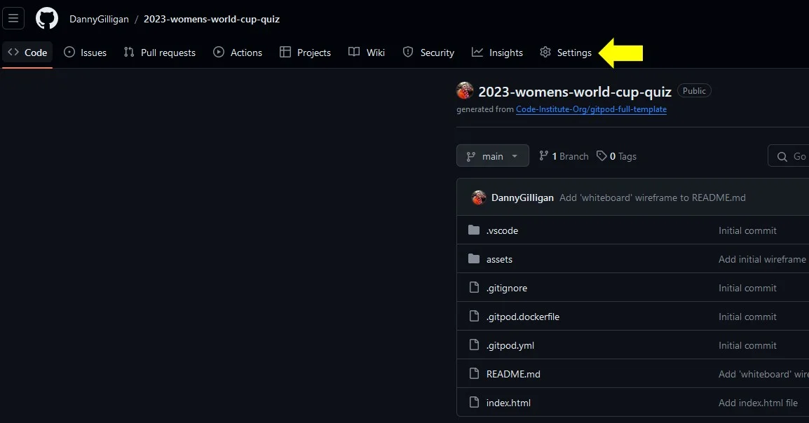

# FIFA 2023 Women's World Cup Quiz

## Table of Contents

* [Introduction](#introduction)
* [Features](#features)
* [Wireframes](#wireframes)
* [Bugs](#bugs)
* [User Stories](#user-stories)
* [Manual Testing](#manual-testing)
* [Deployment](#deployment)
* [Technologies Used](#technologies-used)
* [Credits](#credits)
* [Acknowledgements](#acknowledgements)
 
 
 

<!-- Introduction Section is below, with a 'Back to Top' anchor link, the link will be shown at the bottom of every section -->
## Introduction
The FIFA 2023 Women's World Cup Quiz is the 2nd project deliverable as part of the Code Insititute Diploma in Full Stack Software Development. It is a multiple choice quiz built using Javascript, HTML and CSS.
The topic of the quiz is general knowledge relating to the FIFA 2023 Women's World Cup. The quiz aims to be an entertaining and informative way of increasing exposure and knowledge of women's football, with the intention of helping to increase popularity.
It is aimed at anyone who enjoys quizzes and may have an interest in sports with the hopes of providing this audience with a fun, interactive Javascript product.

The deployed site can be found [here](https://dannygilligan.github.io/2023-womens-world-cup-quiz/).

[Back to Top](#fifa-2023-womens-world-cup-quiz)
 
 
 

<!-- The Existing Features section is shown below, this will be disaplyed in a collapsible format, with each item shown in tabular form -->
## Features

  
 <b>Existing Features</b> 

<!-- Feature 1 begins -->
 
<table>
<tr><td> <b> Customised Logo</b></td></tr>
<tr>
<td>
The official FIFA Women's World Cup 2023 logo has been adapted to incorporate 'Quiz' in the title and serves as a visual highlight of the screen adding vibrant colour to enhance the user experience.
</td>
</tr>
<tr><td Colspan="2">

</td></tr>
</table>
<!-- Feature 1 ends -->
 
<table>
<tr><td> <b>Tracker Panel</b> </td></tr>
<tr><td>
A tracker panel has been developed that provides the user with information on their progress throughout the quiz such as the current question being displayed and which questions were previously answered correctly or incorrectly.
</td></tr>
<tr><td Colspan="2">

</td></tr>
</table>
<!-- spacer -->
 
<table>
<tr><td> <b>Question Container</b> </td></tr>
<tr><td>
The question container takes up a prominent space on the screen and clearly displays the text to the user, the high contrast allows for easy readibility and accessibilty.
</td></tr>
<tr><td Colspan="2">

</td></tr>
</table>
<!-- spacer -->
 
<table>
<tr><td> <b>Choice Container</b> </td></tr>
<tr><td>
The choices can be selected from easy to use containers utilising radio inputs.
</td></tr>
<tr><td Colspan="2">

</td></tr>
</table>
<!-- spacer -->
 
<table>
<tr><td> <b>Main Button</b> </td></tr>
<tr><td>
The user interaction with the quiz is enabled through a simple button that has contextual commands associated with it depending on what screen is currently displayed. The focus is on making the quiz easy to use and accessible.
</td></tr>
<tr><td Colspan="2">

</td></tr>
</table>  
<!-- spacer -->
 
<table>
<tr><td> <b>FWWC 2023 Official Font</b> </td></tr>
<tr><td>
The site uses the official font named 'FWWC 2023' to stay consistent with the brand identity of the event. The source of the font download has been linked in the Credits section.
</td></tr>
<tr><td Colspan="2">

</td></tr>
</table>  
<!-- spacer -->
 
<table>
<tr><td> <b>VAR Assist</b> </td></tr>
<tr><td>
The VAR Assist feature will allow the user to remove two incorrect choices from the screen. When activated, a function will be invoked that replaces the inner HTML of the incorrect choices with 'Offside!', the radio inputs will also be disabled for these choices. The user will be granted 3 VAR Assists at the start of the quiz, and can use 1 per question until they run out.
</td></tr>
<tr><td Colspan="2">

 

</td></tr>
</table>  
<!-- spacer -->
 
<table>
<tr><td> <b>Goals Scored</b> </td></tr>
<tr><td>
A tracker will be visible on the bottom right hand corner of the screen during the quiz that will display the 'Goals Scored' by the user.
</td></tr>
<tr><td Colspan="2">

  

</td></tr>
</table>  
<!-- spacer -->
 
<table>
<tr><td> <b>On Hover Changes</b> </td></tr>
<tr><td>
Any items on the screen that the user can interact with will display a subtle colour change on the box shadow when hovered over to convey that the item can be interacted with by tapping or clicking on it.
</td></tr>
<tr><td Colspan="2">

</td></tr>
</table>
<!-- spacer -->

[Back to Features](#features)
 
 
 

<!-- The Future Features section is shown below, this will be disaplyed in a collapsible format, with each item shown in tabular form -->

  
 <b>Future Features</b>

 
<!-- Future Feature 1 begins -->
<table>
<tr><td><b>Substitution</b></td></tr>
<tr><td>
This feature will allow the user to swap out the question and choice set displayed on screen for another set, this may provide them with a question that they may be able to answer instead. This would possibly involve adding a new 'Substitutes' property to the quizEngine object that would contain the alternative questions and choices values, a function would then change the inner HTML of the containers accordingly once called.
</td></tr>
</table>
<!-- Future Feature 1 ends -->
 
<table>
<tr><td><b>Match Timer</b></td></tr>
<tr><td>
This feature will add a timer to the quiz with a time limit of perhaps 11 minutes, with subtle on screen hints at different checkpoints (e.g "half-time approaching", "approaching the final minute", "we're in injury time"). This would run 'asynchronously' and when it reaches 'full-time', the quiz would end regardless of the user's progression.
</td></tr>
</table>
<!-- spacer -->
 
<table>
<tr><td><b>Home or Away Kit Toggle</b></td></tr>
<tr><td>
This will toggle the colour scheme of the quiz to dark or light modes which will enhance the user experience and aid accessibility.
</td></tr>
</table>
 
<!-- spacer -->
<table>
<tr><td><b>Bonus Facts</b></td></tr>
<tr><td>
Initially I wanted to include bonus facts containing bite size pieces of information about the tournament and women's football in general, these would have been displayed in the container along with the 'GOAL!' or 'MISS!' feedback. It will be added in a future update instead.
</td></tr>
</table>
<!-- spacer -->
 
<table>
<tr><td><b>Hall of Fame</b></td></tr>
<tr><td>
This feature will create a leaderboard to store user scores, adding a competitive dimension to the quiz and perhaps promote sharing, replayibilty and increase enjoyment.
</td></tr>
</table>
<!-- spacer -->
 
<table>
<tr><td><b>Custom Radio Inputs</b></td></tr>
<tr><td>
The project has been deployed with standard/default radio inputs, however these will have customised styling in a future update.
</td></tr>
</table>

[Back to Features](#features)
 
 
 

<!-- Future Features ends here -->

[Back to Top](#fifa-2023-womens-world-cup-quiz)
 
 
 
<!-- Features ends here -->

<!-- The Wireframces section is shown below, this will be disaplyed in a collapsible format, with screenshots -->  
## Wireframes  

Below is a series of wireframes depicting the layout of the screens that will be displayed to the user in different contexts throughout the quiz.  
  

  
  
<b> Enter Username</b>
  
 
<!-- Wireframe 1 1 begins -->
The initial landing page will display the 'FIFA Women's World Cup Quiz 2023' logo, along with an input field to enter a username, and an 'enter' button. 

Validation will occur here, if the username does not meet the requirements a dialogue box will be displayed. If the input is accepted, the value will be assigned to a 'userName' variable.

The 'Enter' button will run the validation function and display the 'Quiz Rules' screen.

To note, the quiz will exist on a single page of HTML, with different sections being displayed to, or hidden from, the user depending on the context.

<!-- Wireframe 1 ends -->
<!-- Wireframe 2 begins -->

  
 <b>Quiz Rules</b>

 
Once the username is accepted, the rules of the quiz will then be displayed using the displayRules() function.

In summary, there will be 11 questions related to the 2023 Women's World Cup, with 4 choices per question along with a VAR Assist feature that will remove 2 incorrect answers. The VAR Assist name comes from the 'Video Assistant Referee' which is a controversial technology used in football to assist in refereeing decisions (hopefully it will only do good things in this quiz). The user will be granted 3 VAR Assists at the beginning, and can use a max of 1 per question until they run out. (To disambiguate completely, there is no relationship to the VAR variable declaration keyword!)

When a question is answered correctly, the user will score a goal, otherwise the attempt will be considered a miss.

The button on this screen will have an inner text of 'Kick Off!' and will call a function to display the quiz content.

<!-- Wireframe 2 ends -->
<!-- Wireframe 3 begins -->

  
 <b>Display Quiz</b>

 
After the user kicks off the quiz, the questions and choices will be displayed using the displayQuiz() function. 

The inner HTML of the question and choice containers will be driven by the content of an object data structure existing in the javascript file, the object will be assigned to a variable named quizEngine. A 'Questions' property will have associated string values that will be accessed using dot notation and their index numbers, this will also be the case for the 'Choices' property, except the Choices property will have a nested array of 4 string values at each index. A questionCounter variable will be created and incremented after each question to drive the content displayed to the user by iterating over the Question and Choices properties accordingly.

A radio input will be used to allow the user to submit their choice, when checking the answer the radio inputs will be assigned as a HTML collection to a userChoice variable, then an IF conditional statement will determine which input is checked, the checked input will be compared against the correct answer (which will be stored as a string value in an 'Answers' property of the quizEngine). The 'Goals Scored' variable will then be incremented by 1 if the answer is correct.

The main button on this screen will have an inner text of 'Shoot!' and will be assigned the checkAnswer() function. 

A VAR Assist button will also be displayed to the user along with the remaining assists available.

In the bottom right hand corner, a score tracker will be visible showing the user's current score.

Just below the logo, a progress tracker will be located that gives the user feedback on the current active question and the questions they answered correctly or incorrectly. The active question will be styled with a prominent glowing effect to aid accessibility.

<!-- Wireframe 3 ends -->
<!-- Wireframe 4 begins -->

  
 <b>VAR Assist Feature</b>

 
The user can decide to trigger the varAssist() feature in order to remove 2 wrong answers from the screen. A 'varAssists' property will be included in the quizEngine object, this property will have 2 choice IDs held as string values in an array at each index that correspond to the wrong answers for each question, these choice IDs will be used to access the related HTML elements and set the display attribute to 'none'. The 'VAR Assists remaining' counter will be decremented upon use until it reaches 0, at this point the VAR Assist button will be disabled for the remainder of the quiz.

Once a choice has been made by the user. the 'Shoot!' button will then trigger the checkAnswer() function.

<!-- Wireframe 4 ends -->
<!-- Wireframe 5 begins -->

  
 <b>Check Answer</b>

 
Once the user has decided on their choice and selected the corresponding radio input, they can then trigger the checkAnswer() function by clicking on the 'Shoot!' button. This will then assign the radio inputs to a HTML collection by utilising the getElementsByClass method (the radio inputs will have a class attribute of 'choices'). 

This HTML collection will then be iterated over using a 'for loop' to determine which input has been checked (using an IF conditional statement). Once the checked input has been identified, this will be stored in a variable named userChoice, which will be compared against the corresponding correct answer for the question held in the 'Answers' property of the quizEngine object (this will be accessed using dot notation and assigned to a variable named correctAnswer).

If the userChoice and correctAnswer variables are equal (===), then feedback will be presented to the user with a 'GOAL!' message and a picture being displayed, the HTML element of the corresponding tracker item will be assigned a class of .correct and the colour will be changed to green (the .active class will be removed). The 'Goals Scored' counter will also be incremented by 1.

If the userChoice and correctAnswer variables are not equal, the feedback will be presented to the user with a 'MISS!' message and a picture being displayed, the HTML element of the corresponding tracker item will be assigned a class of .incorrect and the colour will be changed to red  (the .active class will be removed). The 'Goals Scored' counter will not be incremented. 

The inner HTML of the main button will change to 'Play On!' which when pressed will invoke a nextQuestion() function that will increment the questionCounter variable and display the content of the next question and set of choices to the user.

<!-- Wireframe 5 ends -->
<!-- Wireframe 6 begins -->

  
 <b>Display Next Question</b>

 
The nextQuestion() function will continue the process of iterating over the quizEngine object using the value of the questionCounter variable to access the corresponding index of the questions and choices to display until the final question has been reached. 

This function will also change the HTML class attribute of the current question to .active in order to give the glowing effect on the tracker panel.

When the last question has been answered, the nextQuestion() function will change the inner HTML of the main button to 'View Result!' instead of 'Play On!' and assign to it a function of displayResult().

.webp)
.webp)

<!-- Wireframe 6 ends -->
<!-- Wireframe 7 begins -->

  
 <b>Display Result</b>

 
Once the last question has been answered, the user can click on the 'View Result!' button. This will display feedback to the user on the total goals scored out of the 11 attempts along with a text message congratulating the user on completing the quiz.

An image will also be displayed to the user.

The main button's inner HTML will be changed to 'Rematch!' and have a rematch() function assigned to it.

This screen is the end of the current quiz session.

<!-- Wireframe 7 ends -->
<!-- Wireframe 8 begins -->

  
 <b>Rematch</b>

 
The end screen prompts the user with a 'Rematch!' that will guide them back to the start screen.

This will effectively reset the quiz.

<!-- Wireframe 8 ends -->
<!-- Wireframe 9 begins -->

  
 <b>Whiteboard Wireframe</b>

 
A little bonus for the whiteboard lovers :cupid:
 
 

<!-- Wireframe 9 ends -->

[Back to Top](#fifa-2023-womens-world-cup-quiz)
 
 
 

## Bugs

  
<b>Resolved Bugs</b>

 
<!--sub-section -->

  
<i>Bottom panel layout</i>
  
 
<!-- Resolved Bug 1 begins -->
<table>
<tr><th><b>Bottom Panel Layout</b></th><th><b>Status</b></th></tr>

<tr>
<td>
I encountered issues with displaying the bottom container that holds the VAR Assist and Shoot Buttons, along with the Goals Scored tracker. Initially I thought that using display: flex, and using 'space-between' would automatically position these items evenly, with the shoot button in the centre.
</td>
<td rowspan="4">
:heavy_check_mark:
</td>
</tr>

<tr>
<td>

</td>
</tr>

<tr>
<td>
I was able to resolve the issue by separating the bottom container into 3 sections with widths of 30%, 40% and 30% respectively (yellow borders added for illustration, percentage values may change after deployment), and then set the flex properties for each individual section, and the entire container as a whole. This produced the desired result. 
</td>
</tr>

<td>

</td>
</tr>
</table>

<!-- Resolved Bug 1 ends -->
<!-- Resolved But 2 begins -->

  
<i>Font Import Issue</i>

 
<table>
<tr><th><b>Font Import Issue</b></th><th><b>Status</b></th></tr>
<tr>
<td>
I experienced problems when importing the 'FWWC2023' font, I could not get it to load successfully initially (even after several attempts). I found a very helpful video by Kevin Powell on how to self-host fonts that helped, the video resource is linked in the Credits section. I also received very helpful advice and a suggested Stackoverflow post from my mentor Martina Terlevic which allowed me to resolve the issue completely. 
</td>
<td>
:heavy_check_mark:
</td>
</tr>
</table>
 

<!-- Resolved Bug 2 ends -->
<!-- Resolved Bug 3 begins -->

  
<i>Image Naming Index</i>

 
<table>
<tr><th><b>Image Naming Index</b></th><th><b>Status</b></th></tr>
<tr>
<td>
Once all images were selected for the 'GOAL!' and 'MISS!' feedback screens, I proceeded to crop, copy and resize for thumbnails then convert them to .webp files. However, I initially overlooked the naming convention and started the file name sequence at 1 instead of 0. This would have thrown off the function that would loop through these images using an index starting at 0 (i.e, the questionCounter's initial value). I renamed the image files accordingly.
 
 
The first image filenames in the sequence are now goal_image_0.webp and miss_image_0.jpg, instead of goal_image_1.webp and miss_image_1.jpg.
</td>
<td>
:heavy_check_mark:
</td>
</tr>
</table>
 

<!-- Resolved Bug 3 ends -->
<!-- Resolved Bug 4 begins -->

  
<i>InnerText Display</i>

 
<table>
<tr><th><b>InnerText Display</b></th><th><b>Status</b></th></tr>
<tr>
<td>
While testing the initial screens displayed to the user, such as the 'display rules' and 'display choices' screens, I noticed the innerText of the main dialogue box was not behaving as expected. It appeared to be 'stuck' on the welcome message.
</td>
<td rowspan="4">
:heavy_check_mark:
</td>
</tr>

<tr>
<td>

</td>
</tr>

<tr>
<td>
The issue related to the innerText property that was attached to the this dialogue box when it was declared as a variable. Once the innerText property was removed, the screens displayed the correct/expected text to the user.
</td>
</tr>

<td>

</td>
</tr>
</table>

<!-- Resolved Bug 4 ends -->
<!-- Resolved Bug 5 begins -->

  
<i>Image Responsiveness</i>

 
<table>
<tr><th><b>Image Responsiveness</b></th><th><b>Status</b></th></tr>
<tr>
<td>
During testing, the images displayed at the answer feedback stage lost responsiveness. I was following a mobile first approach and focused my initial styling for smaller screen devices. When testing for larger screens, the bug was discovered.
</td>
<td rowspan="4">
:heavy_check_mark:
</td>
</tr>

<tr>
<td>

</td>
</tr>

<tr>
<td>
The issue was resolved by applying a 'max-width' property to the #answer-feedback-image rule.
</td>
</tr>

<td>

</td>
</tr>
</table>

<!-- Resolved Bug 5 ends -->

<!-- Resolved Bugs section ends here -->

[Back to Top](#fifa-2023-womens-world-cup-quiz)
 
 
 

## User Stories

<!-- 'As a user' User Stories are shown below -->

  
<b>As a User</b>

 
<table>
<tr>
<th>User Story</th><th>Result</th>
</tr>
<!-- User Story 1 begins -->
<tr>
<td>As a user, I can enter a username</td><td>:heavy_check_mark:</td>
</tr>
<!-- User Story 1 ends -->
<tr>
<td>As a user, if the username I submit is invalid, I am alerted to this and the requirements are emphasised to me</td><td>:heavy_check_mark:</td>
</tr>
<!-- spacer -->
<tr>
<td>As a user, I can clearly read the question text displayed to me</td><td>:heavy_check_mark:</td>
</tr>
<!-- spacer -->
<tr>
<td>As a user, I can easily read the choices text that is displayed to me</td><td>:heavy_check_mark:</td>
</tr>
<!-- spacer -->
<tr>
<td>As a user, I can select a choice by tapping or clicking on the associated radio input</td><td>:heavy_check_mark:</td>
</tr>
<!-- spacer -->
<tr>
<td>As a user, I can tap or click on the 'Shoot!' button to submit my choice</td><td>:heavy_check_mark:</td>
</tr>
<!-- spacer -->
<tr>
<td>As a user, I can easily identify the VAR Assist button and tap or click on it</td><td>:heavy_check_mark:</td>
</tr>
<!-- spacer -->
<tr>
<td>As a user, I can easily see my progress throughout the quiz including the current active question and the questions I answered correctly or incorrectly previously</td><td>:heavy_check_mark:</td>
</tr>
<!-- spacer -->
<tr>
<td>As a user, I can easily see my current score</td><td>:heavy_check_mark:</td>
</tr>
<!-- spacer -->
<tr>
<td>As a user, I am provided with instant and clear feedback on whether my answer was correct or incorrect</td><td>:heavy_check_mark:</td>
</tr>
<!-- spacer -->
<tr>
<td>As a user, when I choose to use the VAR Assist feature, I can clearly determine which choices remain selectable and which have been changed to 'Offside!'</td><td>:heavy_check_mark:</td>
</tr>
<!-- spacer -->
<tr>
<td>As a user, I can clearly see how many VAR Assists I have remaining</td><td>:heavy_check_mark:</td>
</tr>
<!-- spacer -->
<tr>
<td>As a user, I can clearly determine when the quiz has ended</td><td>:heavy_check_mark:</td>
</tr>
<!-- spacer -->
<tr>
<td>As a user, I am provided with a final result</td><td>:heavy_check_mark:</td>
</tr>
</table>

<!-- 'As a Developer' User Stories are shown below -->

  
<b>As a Developer</b>

 
<table>
<tr>
<th>User Story</th><th>Result</th>
</tr>
<!-- spacer -->
<tr>
<td>As a developer, I can easily access the quizEngine object in order to make any amendments such as new questions, choices, answers and VAR assists</td><td>:heavy_check_mark:</td>
</tr>
<!-- spacer -->
<tr>
<td>As a developer, I can easily navigate the code in the HTML file and I am provided with clear comments throughout</td><td>:heavy_check_mark:</td>
</tr>
<!-- spacer -->
<tr>
<td>As a developer, I can easily navigate the code in the CSS file and I am provided with clear comments throughout</td><td>:heavy_check_mark:</td>
</tr>
<!-- spacer -->
<tr>
<td>As a developer, I can easily navigate the code in the Javascript file and I am provided with clear comments throughout</td><td>:heavy_check_mark:</td>
</tr>
<!-- spacer -->
<tr>
<td>As a developer, I am provided with a comprehensive README.md file that details the functionality of the site and deployment steps</td><td>:heavy_check_mark:</td>
</tr>
<!-- spacer -->
</table>

<!-- User Stories section ends here -->

[Back to Top](#fifa-2023-womens-world-cup-quiz)
 
 
 

## Manual Testing

<table>

<tr><th rowspan="2">Test description</th><th colspan="3">Device</th></tr>
<tr><th>Phone</th><th>Tablet</th><th>Laptop</th></tr>
<tr><td>Test 1</td><td>:heavy_check_mark:</td><td>:heavy_check_mark:</td><td>:heavy_check_mark:</td></tr>
<tr><td>Test 1</td><td>:heavy_check_mark:</td><td>:heavy_check_mark:</td><td>:heavy_check_mark:</td></tr>
<tr><td>Test 1</td><td>:heavy_check_mark:</td><td>:heavy_check_mark:</td><td>:heavy_check_mark:</td></tr>
<tr><td>Test 1</td><td>:heavy_check_mark:</td><td>:heavy_check_mark:</td><td>:heavy_check_mark:</td></tr>
<tr><td>Test 1</td><td>:heavy_check_mark:</td><td>:heavy_check_mark:</td><td>:heavy_check_mark:</td></tr>
<tr><td>Test 1</td><td>:heavy_check_mark:</td><td>:heavy_check_mark:</td><td>:heavy_check_mark:</td></tr>
<tr><td>Test 1</td><td>:heavy_check_mark:</td><td>:heavy_check_mark:</td><td>:heavy_check_mark:</td></tr>
<tr><td>Test 1</td><td>:heavy_check_mark:</td><td>:heavy_check_mark:</td><td>:heavy_check_mark:</td></tr>
<tr><td>Test 1</td><td>:heavy_check_mark:</td><td>:heavy_check_mark:</td><td>:heavy_check_mark:</td></tr>
<tr><td>Test 1</td><td>:heavy_check_mark:</td><td>:heavy_check_mark:</td><td>:heavy_check_mark:</td></tr>

</table>

[Back to Top](#fifa-2023-womens-world-cup-quiz)
 
 
 

<!-- The Deployment section is shown below, this will be disaplyed in a collapsible format, with each item shown in tabular form -->
## Deployment

The site was deployed as a Minimum Viable Product using Github pages. 

    
<b>The steps for deployment are outlined here</b>

 
<table>

<!-- spacer -->
<tr><td colspan="2">In the Github repository, navigate to the 'Settings' tab</td></tr>
<tr><td>

</td>
<td>:heavy_check_mark:</td>
</tr>
<!-- spacer -->
<tr><td colspan="2">On the menu, navigate to 'Pages'</td></tr>
<tr><td>

</td>
<td>:heavy_check_mark:</td>
</tr>
<!-- spacer -->
<tr><td colspan="2">From the 'Branch' dropdown menu, select 'main'</td></tr>
<tr><td>

</td>
<td>:heavy_check_mark:</td>
</tr>
<!-- spacer -->
<tr><td colspan="2">Click the save button</td></tr>
<tr><td>

</td>
<td>:heavy_check_mark:</td>
</tr>
<!-- spacer -->
<tr><td colspan="2">The deployment process begins</td></tr>
<tr><td>

</td>
<td>:heavy_check_mark:</td>
</tr>
<!-- spacer -->
<tr><td colspan="2">Once the site deploys successfully, a confirmation is displayed and a live link generated</td></tr>
<tr><td>

</td>
<td>:heavy_check_mark:</td>
</tr>
</table>

The live link to this site is https://dannygilligan.github.io/2023-womens-world-cup-quiz/

<!-- Deployment section ends here -->

[Back to Top](#fifa-2023-womens-world-cup-quiz)
 
 
 

<!-- The Technologies Used section is shown below, this will be disaplyed in tabular form with icons for each technology -->
## Technologies Used

#### 
<table>
<tr><th>Logo</th><th>Name</th><th>Primary Role</th><th>Link</th></tr>
<!-- Technology Used 1 begins -->
<tr><td>

	<code></code>

</td>
<td>Javascript</td>
<td>Site interaction</td>
<td>https://developer.mozilla.org/en-US/docs/Web/JavaScript</td>
</tr>
<!-- Technology Used 1 ends -->
<tr><td>

	<code></code>

</td>
<td>HTML 5</td>
<td>Site structure</td>
<td>https://dev.w3.org/html5/spec-LC/</td>
</tr>
<!-- spacer -->
<tr><td>

	<code></code>

</td>
<td>CSS 3</td>
<td>Site Styling</td>
<td>https://www.w3.org/TR/2001/WD-css3-roadmap-20010523/</td>
</tr>
<!-- spacer -->
<tr><td>

	<code></code>

</td>
<td>W3C</td>
<td>HTML & CSS Validation</td>
<td>https://validator.w3.org/docs/</td>
</tr>
<!-- spacer -->
<tr><td>

	<code></code>

</td>
<td>JSHint</td>
<td>Javascript Validation</td>
<td>https://jshint.com/docs/</td>
</tr>
<!-- spacer -->
<tr><td>

	<code></code>

</td>
<td>Balsamiq</td>
<td>Wireframing</td>
<td>https://balsamiq.com/docs/</td>
</tr>
<!-- spacer -->
<tr><td>

	<code></code>

</td>
<td>Github</td>
<td>Site repository</td>
<td>https://docs.github.com/en</td>
</tr>
<!-- spacer -->
<tr><td>

	<code></code>

</td>
<td>Gitpod</td>
<td>Site development, IDE</td>
<td>https://www.gitpod.io/docs/introduction</td>
</tr>
<!-- spacer -->
<tr><td>

	<code></code>

</td>
<td>Coffee</td>
<td>Site fuel</td>
<td>https://en.wikipedia.org/wiki/Coffee</td>
</tr>
<!-- spacer -->
<tr><td>

	<code></code>

</td>
<td>Google</td>
<td>Superhero</td>
<td>https://www.google.com/</td>
</tr>
<!-- spacer -->
</table>
<!-- Technologies Used section ends here -->

[Back to Top](#fifa-2023-womens-world-cup-quiz)
 
 
 

## Credits

<!-- The Credits section is shown below, this will be disaplyed in a collapsible format, with a sub section for reference content/materials and a sub section for images, with each item shown in tabular form -->

    
Reference Materials Used

 
<table>
<tr><th><b> Description </b></th><th><b> Link </b></th></tr>
<!-- Reference Material 1 begins -->
<tr><td> Code Institute LMS Javascript Essentials Content </td>
<td> 

[here](https://codeinstitute.net/) 

</td></tr>
<!-- Reference Material 1 ends -->
<tr><td> Javascript tutorial video produced by 'Bro Code' YouTube Channel</td>
<td> 

[here](https://www.youtube.com/watch?v=8dWL3wF_OMw)  

</td></tr>
<!-- spacer -->
<tr><td> Javascript 30 for 30 tutorials produced by Wes Bos</td>
<td> 

[here](https://javascript30.com/)

</td></tr>
<!-- spacer -->
<tr><td> W3 Schools Javascript Tutorial, Exercises and Quiz, published by w3schools.com </td>
<td> 

[here](https://www.w3schools.com/js/default.asp) 

</td></tr>
<!-- spacer -->
<tr><td> JS Challenger exercises, published by jschallenger.com </td>
<td> 

[here](https://www.jschallenger.com/)

</td></tr>
<!-- spacer -->
<tr><td> Guide on using the transform property, published by geeksforgeeks.org </td>
<td> 

[here](https://www.geeksforgeeks.org/how-to-rotate-an-html-div-element-90-degrees-using-javascript/)

</td></tr>
<!-- spacer -->
<tr><td> Code Institute README.md Tutorial by Kasia Bogucka </td>
<td> 

[here](https://www.youtube.com/watch?v=l1DE7L-4eKQ)  

</td></tr>
<!-- spacer -->
<tr><td> Code Institute Guide to MVP (PP2) by Kasia Bogucka </td>
<td> 

[here](https://www.youtube.com/watch?v=wsOvkf22B_A)  

</td></tr>
<!-- spacer -->
<tr><td> Official FIFA 2023 Women's World Cup colour scheme published by schemecolor.com </td>
<td> 

[here](https://www.schemecolor.com/fifa-womens-world-cup-2023-logo.php)  

</td></tr>
<!-- spacer -->
<tr><td> Official FIFA 2023 Women's World Cup font, downloaded from fontshub.pro </td>
<td> 

[here](https://fontshub.pro/font/fwwc-2023-download)

</td></tr>
<!-- spacer -->
<tr><td> Flexbox guide, published by css-tricks.com </td>
<td> 

[here](https://css-tricks.com/snippets/css/a-guide-to-flexbox/)  

</td></tr>
<!-- spacer -->
<tr><td> Guide to self-hosting fonts, published by Kevin Powell </td>
<td> 

[here](https://www.youtube.com/watch?v=zK-yy6C2Nck)

</td></tr>
<!-- spacer -->
<tr><td> Centering items using Flexbox, published by MDN Web Docs </td>
<td> 

[here](https://developer.mozilla.org/en-US/docs/Web/CSS/CSS_flexible_box_layout/Aligning_items_in_a_flex_container)  

</td></tr>
<!-- spacer -->
<tr><td> Code used for spherical shading on main button developed by 'The Anonymous Koder' </td>
<td> 

[here](https://codepen.io/theanonymouskoder/pen/PomjmeY?editors=1100)  

</td></tr>
<!-- spacer -->
<tr><td> Code used for CSS gradient effects provided by cssgradient.io </td>
<td> 

[here](https://cssgradient.io/)

</td></tr>
<!-- spacer -->
<tr><td> Guide for using the CSS 'fade in' animation, published by Jamie Juviler </td>
<td> 

[here](https://blog.hubspot.com/website/css-fade-in)

</td></tr>
<!-- spacer -->
</td></tr>
<tr><td> Guide on scaling an element up and down gracefully on hover, by Stackoverflow user Roy </td>
<td> 

[here](https://stackoverflow.com/a/36227036)

</td></tr>
<!-- spacer -->
<tr><td> Guide for styling input placeholder text, published by MDN Web Docs </td>
<td> 

[here](https://developer.mozilla.org/en-US/docs/Web/CSS/::placeholder) 

</td></tr>
<!-- spacer -->
<tr><td> Code Institute README.md Template, published by Code Institute </td>
<td> 

[here](https://github.com/Code-Institute-Solutions/readme-template)  

</td></tr>
<!-- spacer -->
<tr><td> Github README.md Markdown Guide, by Github user lifeparticle </td>
<td> 

[here](https://github.com/lifeparticle/Markdown-Cheatsheet)  

</td></tr>
<!-- spacer -->
<tr><td> Github README.md Cheatsheet, by Github user tchapi </td>
<td> 

[here](https://github.com/tchapi/markdown-cheatsheet/blob/master/README.md)

</td></tr>
<!-- spacer -->
<tr><td> The hex values of the Github background colour were obtained using imagecolorpicker.com </td>
<td> 

[here](https://imagecolorpicker.com/en)

</td></tr>
<!-- spacer -->
<tr><td> How to create anchor links in README.md, by Github user Rachel Hyman </td>
<td> 

[here](https://gist.github.com/rachelhyman/b1f109155c9dafffe618)  

</td></tr>
<!-- spacer -->
<tr><td> How to add collapsible items to README.md, by Github user pierrejoubert73 </td>
<td> 

[here](https://gist.github.com/pierrejoubert73/902cc94d79424356a8d20be2b382e1ab)

</td></tr>
<!-- spacer -->
</td></tr>
<tr><td> Advice to add documentation folder to README.md, Code Institute Slack message by Kera Cudmore </td>
<td> 

[here](https://code-institute-room.slack.com/archives/C01UE4ND3H7/p1701601763768449?thread_ts=1701600346.836459&cid=C01UE4ND3H7)

</td></tr>
<!-- spacer -->
<tr><td> How to add a tickmark to README.md, by Stackoverflow user Waylan </td>
<td> 

[here](https://stackoverflow.com/questions/54694160/adding-checkbox-in-markdown-table-does-not-work)

</td></tr>
<!-- spacer -->
<tr><td> Github emojis cheatsheet, by Github user ikatyang </td>
<td> 

[here](https://github.com/ikatyang/emoji-cheat-sheet/blob/master/README.md)

</td></tr>
<!-- spacer -->
<tr><td> Site used to convert png to favicon, favicon.io </td>
<td> 

[here](https://favicon.io/favicon-converter/)

</td></tr>
<!-- spacer -->
<tr><td> Guide to making atomic git commits, by Aleksandr Hovhannisyan </td>
<td> 

[here](https://www.aleksandrhovhannisyan.com/blog/atomic-git-commits/)

</td></tr>
<!-- spacer -->
<tr><td> Library of front end icons used for README.md, by Github user marwin1991 </td>
<td> 

[here](https://marwin1991.github.io/profile-technology-icons/)

</td></tr>
<!-- spacer -->
<tr><td> Site containing open source icons used for README.md, published by iconduck.com </td>
<td> 

[here](https://iconduck.com/)

</td></tr>
<!-- spacer -->
<tr><td> Site used to convert svg to png, svgtopng.com </td>
<td> 

[here](https://svgtopng.com/)

</td></tr>
<!-- spacer -->
<tr><td> How to make a cell span a row, used in README.md, by Stackoverflow user Nisse Engström </td>
<td> 

[here](https://stackoverflow.com/questions/26400006/make-a-td-span-the-entire-row-in-a-table)

</td></tr>
<!-- spacer -->
<tr><td> Introduction to the pillars of OOP, by Chandrakishor Gupta </td>
<td> 

[here](https://datatrained.com/post/four-pillars-of-oops/)

</td></tr>
<!-- spacer -->
<tr><td> Guide on HTML Radio Input Tags, published by w3schools.com </td>
<td> 

[here](https://www.w3schools.com/tags/att_input_type_radio.asp)

</td></tr>
<!-- spacer -->
<tr><td> How to use a submit button outside the form, by joshbranchaud </td>
<td> 

[here](https://til.hashrocket.com/posts/v2s2gxgifj-submit-a-form-with-a-button-outside-the-form)

</td></tr>
<!-- spacer -->
<tr><td> Guide to mobile first responsive design, published by Code Institute </td>
<td> 

[here](https://www.youtube.com/watch?v=JcaX60ZscgA)

</td></tr>
<!-- spacer -->
<tr><td> Guide to displaying a 'flash' effect animation, by Stackoverflow user Rohith </td>
<td> 

[here](https://stackoverflow.com/questions/16791851/a-flash-of-color-using-pure-css-transitions)

</td></tr>
<!-- spacer -->
<tr><td> Guide on adding minlength and maxlength HTML attributes, published by MDN Web Docs </td>
<td> 

[here](https://developer.mozilla.org/en-US/docs/Web/HTML/Attributes/minlength)

</td></tr>
<!-- spacer -->
<tr><td> Guide on the syntax for CSS animations, published by w3schools.com </td>
<td> 

[here](https://www.w3schools.com/cssref/css3_pr_animation.php)

</td></tr>
<!-- spacer -->
</table>

<!-- Reference Materials credits section ends here -->
<!-- The Images sub section is shown below, this will be disaplyed in a collapsible format, with each item shown in tabular form, the images represent thumbnails of the actual pictures used on the live site (they've been scaled down to 10% of the original size, approx 50px by 50px) -->

  
Images

 

<table>
<tr><th><b> Thumb </b></th><th><b> Production File Name </b></th><th><b> Description </b></th><th><b> Source </b></th></tr>
<!-- image 1 begins -->
<tr><td>

</td>
<td>miss_image_0</td>
<td>Emily van Egmond, Australia</td>
<td>

[here](https://www.sbs.com.au/news/article/what-must-happen-for-matildas-to-progress-to-world-cup-knockout/hn6ggt6eq)
</td>
</tr>
<!-- image 1 ends -->
<tr><td>

</td>
<td>miss_image_1</td>
<td>Giulia Dragoni, Italy</td>
<td>

[here](https://www.ctvnews.ca/mobile/sports/italians-in-tears-after-loss-to-south-africa-knocks-them-out-of-women-s-world-cup-1.6503519)
</td>
</tr>
<!-- spacer -->
<tr><td>

</td>
<td>miss_image_2</td>
<td>Julie Ertz, USA</td>
<td>

[here](https://www.forbes.com/sites/maryroeloffs/2023/08/06/us-knocked-out-of-womens-world-cup-after-dramatic-loss-to-sweden/
)
</td>
</tr>
<!-- spacer -->
<tr><td>

</td>
<td>miss_image_3</td>
<td>Sam Kerr, Australia</td>
<td>

[here](https://www.forbes.com/sites/asifburhan/2023/08/16/england-defeat-hosts-australia-to-reach-first-womens-world-cup-final/)
</td>
</tr>
<!-- spacer -->
<tr><td>

</td>
<td>miss_image_4</td>
<td>Megan Rapinoe, USA</td>
<td>

[here](https://edition.cnn.com/sport/live-news/uswnt-sweden-womens-world-cup-knockout/h_9d56c79135d15aab65841753a8692a16
)
</td>
</tr>
<!-- spacer -->
<tr><td>

</td>
<td>miss_image_5</td>
<td>Sophie Howard, Scotland</td>
<td>

[here](https://domesticolammy.medium.com/salma-paralluelo-and-my-uneven-connection-with-womens-football-a8a99bc4dd10
)
</td>
</tr>
<!-- spacer -->
<tr><td>

</td>
<td>miss_image_6</td>
<td>Alex Morgan, USA</td>
<td>

[here](https://www.the-express.com/sport/soccer/109905/USWNT-lose-top-spot-FIFA-Rankings
)
</td>
</tr>
<!-- spacer -->
<tr><td>

</td>
<td>miss_image_7</td>
<td>Sam Kerr, Australia</td>
<td>

[here](https://www.foxsports.com.au/football/world-cup/changed-sport-forever-australia-reacts-to-matildas-devastating-world-cup-exit/news-story/de2c94a88de3019c2af2e7eae2f81774
)
</td>
</tr>
<!-- spacer -->
<tr><td>

</td>
<td>miss_image_8</td>
<td>Mary Earps, England</td>
<td>

[here](https://www.bbc.com/sport/football/66611861
)
</td>
</tr>
<!-- spacer -->
<tr><td>

</td>
<td>miss_image_9</td>
<td>Hannah Wilkinson, New Zealand</td>
<td>

[here](https://www.abc.net.au/news/2023-07-25/womens-world-cup-live-updates-new-zealand-philippines-var/102644612
)
</td>
</tr>
<!-- spacer -->
<tr><td>

</td>
<td>miss_image_10</td>
<td>Alexandra Popp, Germany</td>
<td>

[here](https://www.goal.com/en/news/shock-germany-out-womens-world-cup-group-stages-south-korea/bltb2277dcbc1244f38)
</td>
</tr>
<!-- Miss Images end here -->
<!-- Goal Images start here -->
<tr><td>

</td>
<td>goal_image_0</td>
<td>Sam Kerr, Australia</td>
<td>

[here](https://www.theguardian.com/football/commentisfree/2023/aug/16/womens-world-cup-2023-matildas-fan-guide)
</td>
</tr>
<!-- spacer -->
<tr><td>

</td>
<td>goal_image_1</td>
<td>Wendy Shongwe, South Africa</td>
<td>

[here](https://www.flashscore.com/news/soccer-world-cup-women-south-africa-s-joy-at-women-s-world-cup-win-brings-hope-of-change-back-home/n9c0NhLj/)
</td>
</tr>
<!-- spacer -->
<tr><td>

</td>
<td>goal_image_2</td>
<td>Fridolina Rolfo, Sweden</td>
<td>

[here](https://www.latimes.com/sports/soccer/story/2023-08-19/womens-world-cup-sweden-beats-australia-bronze-medal)
</td>
</tr>
<!-- spacer -->
<tr><td>

</td>
<td>goal_image_3</td>
<td>Filippa Angeldal, Sweden</td>
<td>

[here](https://eu.usatoday.com/story/sports/soccer/2023/08/11/sweden-stakes-claim-as-a-women-s-world-cup-favorite-by-stopping-japan-2-1-in-quarterfinals/70572973007/)
</td>
</tr>
<!-- spacer -->
<tr><td>

</td>
<td>goal_image_4</td>
<td>Kenza Dali, France</td>
<td>

[here](https://newsrnd.com/sports/2023-08-08-france-morocco-(4-0)--les-bleues-join-the-quarters-of-the-women-s-world-cup-without-trembling.BJXjfpknn.html)
</td>
</tr>
<!-- spacer -->
<tr><td>

</td>
<td>goal_image_5</td>
<td>Sarina Bolden, Philippines</td>
<td>

[here](https://www.nzherald.co.nz/sport/fifa-womens-world-cup-2023-football-ferns-crash-back-down-to-earth-with-shock-loss-to-the-philippines/PCDJNAO7SRCRTFMBTGIB5RNWNM/)
</td>
</tr>
<!-- spacer -->
<tr><td>

</td>
<td>goal_image_6</td>
<td>Débora Cristiane de Oliveira, Brazil</td>
<td>

[here](https://www.skysports.com/football/story-telling/37390/12944561/20-of-the-best-images-from-the-womens-world-cup)
</td>
</tr>
<!-- spacer -->
<tr><td>

</td>
<td>goal_image_7</td>
<td>Yui Hasegawa, Japan</td>
<td>

[here](https://www.forbes.com/sites/asifburhan/2020/03/02/fifa-inspectors-assess-potential-hosts-of-the-2023-womens-world-cup/)
</td>
</tr>
<!-- spacer -->
<tr><td>

</td>
<td>goal_image_8</td>
<td>Ary Borges, Brazil</td>
<td>

[here](https://www.theguardian.com/football/2023/jul/27/brazil-womens-world-cup-fans-france-revival)
</td>
</tr>
<!-- spacer -->
<tr><td>

</td>
<td>goal_image_9</td>
<td>Charlotte Grant, Australia</td>
<td>

[here](https://shekicks.net/matildas-end-lionesses-30-game-unbeaten-run/)
</td>
</tr>
<!-- spacer -->
<tr><td>

</td>
<td>goal_image_10</td>
<td>Denise O'Sullivan, Ireland</td>
<td>

[here](https://www.uefa.com/womensworldcup/news/0283-1876eee8e56e-635398217fd4-1000--republic-of-ireland-at-the-2023-women-s-world-cup-fixtures-r/)
</td>
</tr>
<!-- Goal images end here -->
<!-- Miscellaneous images start here -->
<tr><td>

</td>
<td>hero_image_updated</td>
<td>Offical FIFA WWC 2023 Logo</td>
<td>

[here](https://www.printmag.com/branding-identity-design/2023-fifa-womens-world-cup/)
</td>
</tr>
<!-- spacer -->
<tr><td>

</td>
<td>favicon</td>
<td>Source used to generate favicon</td>
<td>

[here](https://seeklogo.com/vector-logo/495259/fifa-womens-world-cup-2023)
</td>
</tr>
</table>

<!-- Images credits end here -->

[Back to Top](#fifa-2023-womens-world-cup-quiz)
 
 
 

## Acknowledgements

[Back to Top](#fifa-2023-womens-world-cup-quiz)
 
 
 